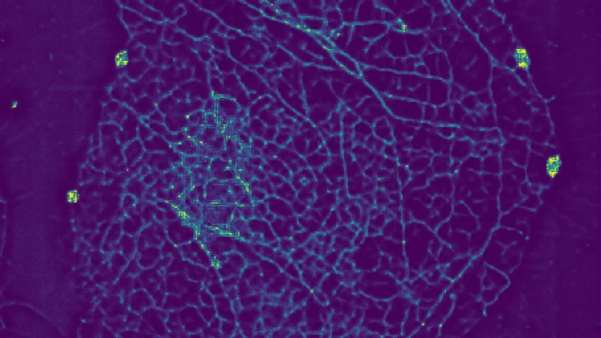
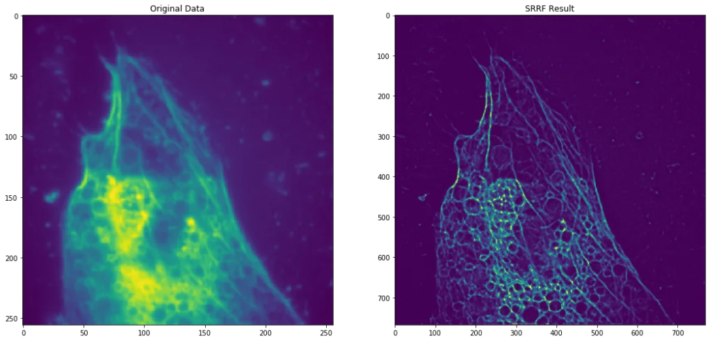
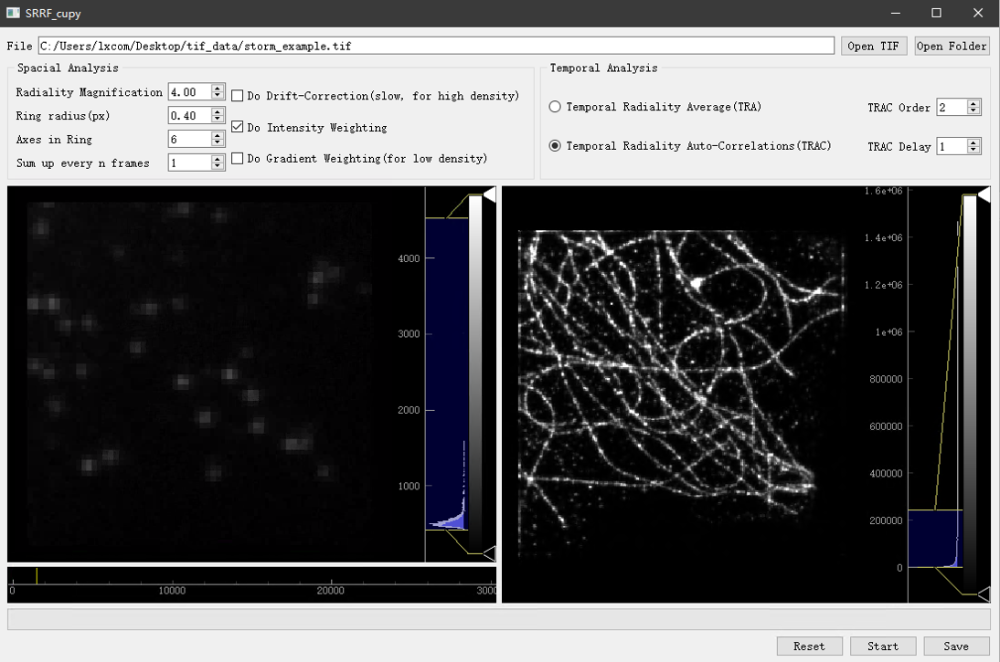

# SRRF-CUPY

An implementation of super-resolution radial fluctuations(SRRF) with CUDA support.

## Overview

This program helps improve the resolution of fluorescent microscoping, based on the statistic properties of fluorescent fluctuation.

Here is the [paper](https://www.osapublishing.org/oe/abstract.cfm?URI=oe-27-26-38337)

## Installation

edit `cupy-cuda100` in `requirements.txt` to fit your CUDA version. 

for CUDA 8.0, change it to `cupy-cuda80`  
for CUDA 9.1, change it to `cupy-cuda91`  
for CUDA 10.1, change it to `cupy-cuda101`  

You can reference [installation guide of CuPy](https://docs-cupy.chainer.org/en/stable/install.html#install-cupy).

Then

    pip install .

## Usage

### GUI

After you have all dependencies installed, run

    python ./srrf_cupy/ui_srrf.py

or

    python -m srrf_cupy

if GUI fails to start, a simple CLI version for debug will start instead.

### Import as a module

    import srrf_cupy.srrf as srrf
    
    # read data from a folder
    img_array = srrf.read_images_from_folder(folder_path)     
    
    # or read data from a tiff file
    img_array = srrf.read_images_from_tiff_file(file_path)    
    
    # run SRRF with default args
    ret_img_array = srrf.srrf(img_array)
    
    # show result
    srrf.plot_result(img_array, ret_img_array)
